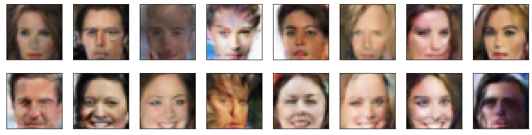

# Face Generation

## Project Overview
In this project, we'll define and train a DCGAN on a dataset of faces. The goal is to get a generator network to generate new images of faces that look as realistic as possible!

The project will be broken down into a series of tasks from loading in data to defining and training adversarial networks. At the end of the notebook, we'll be able to visualize the results of the trained Generator to see how it performs; the generated samples should look like fairly realistic faces with small amounts of noise.

### Project Files
The project includes the following files:
* `README.md` - A markdown file explaining the project structure and training approach and new generated "fake" faces
* `dlnd_face_generation.ipynb` - Jupyter Notebook describing the project
* `dlnd_face_generation.html` - HTML version of the Jupyter Notebook
* `problem_unittests.py` - unit tests for each part of the project code

## Results
The trained network is used to generate new fake faces. Few Generator samples from training are shown below:

